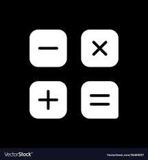

The Calculator project is a straightforward application that I developed as a personal project in 2024. This project allowed me to enhance my JavaScript skills and practice building user interfaces with HTML and CSS.

The calculator supports basic arithmetic operations including addition, subtraction, multiplication, and division. The implementation covers both the front-end and basic logic for handling user input and calculations.

### Sample Code

Here is some sample code for the Calculator application:

#### HTML

```html
<!DOCTYPE html>
<html lang="en">
<head>
    <meta charset="UTF-8">
    <meta name="viewport" content="width=device-width, initial-scale=1.0">
    <title>Calculator</title>
    <link rel="stylesheet" href="calculator.css">
</head>
<body>
    <div class="calculator">
        <input type="text" id="display" disabled>
        <div class="buttons">
            <button class="btn" data-action="clear">C</button>
            <button class="btn" data-action="divide">/</button>
            <button class="btn" data-action="multiply">*</button>
            <button class="btn" data-action="subtract">-</button>
            <button class="btn" data-action="add">+</button>
            <button class="btn" data-action="decimal">.</button>
            <button class="btn" data-action="equals">=</button>
            <button class="btn" data-action="0">0</button>
            <button class="btn" data-action="1">1</button>
            <button class="btn" data-action="2">2</button>
            <button class="btn" data-action="3">3</button>
            <button class="btn" data-action="4">4</button>
            <button class="btn" data-action="5">5</button>
            <button class="btn" data-action="6">6</button>
            <button class="btn" data-action="7">7</button>
            <button class="btn" data-action="8">8</button>
            <button class="btn" data-action="9">9</button>
        </div>
    </div>
    <script src="calculator.js"></script>
</body>
</html>
